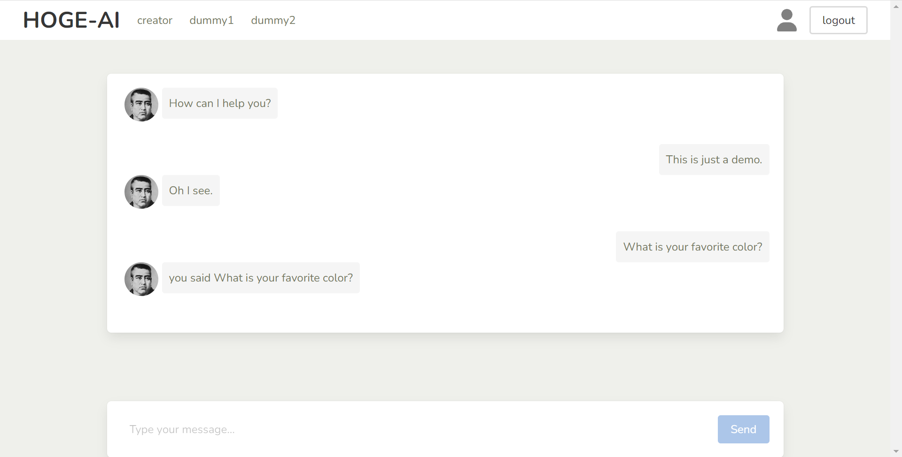

kagomma.i
===

Hi, this is my hobby project dedicated for my homeland [Kagoshima](https://en.wikipedia.org/wiki/Kagoshima)(a.k.a. Kagomma).
kagomma.i is a chatbot that can reply to any message with Kagoshima information with :love:.

running site: https://kagomma.info

I launched this site 2023 May, maybe will stop in a few months(sorry!).
If you're interested, you can launch this locally like below.

## technologies

- flask
- nuxt3
- bulma.css
- OpenAI-API

## build & launch (locally)

please create backend/.env (refer to .env.sample)

```bash
docker-compose -f docker-compose.local.yml up -d
```
=> http://localhost



## license

This project is licensed under the [MIT license](/LICENSE.md), Copyright (c) 2023 Hitoshi Wada.
