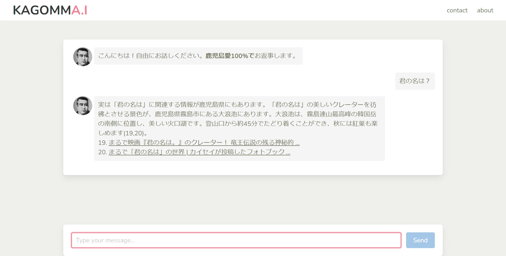

kagomma.i backend
===

:thumbsup: you can use npm / yarn instead of pnpm, of course!

## commands

install
```bash
pnpm install
```

format
```bach
pnpm run format
```

launch
```bash
pnpm run dev
```
=> `http://localhost:3000`




## refs

[Nuxt 3 documentation](https://nuxt.com/docs/getting-started/introduction)
